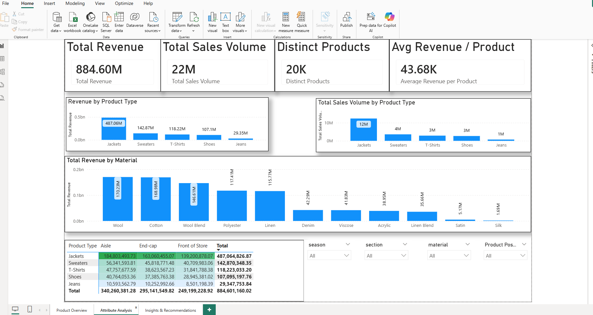
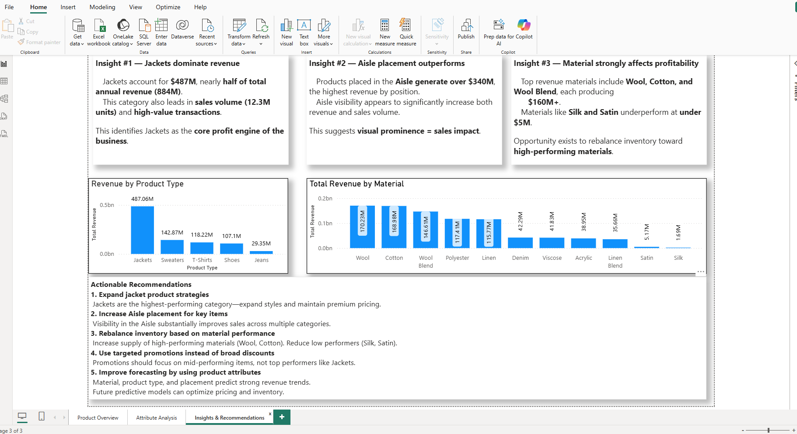

Custom BI Project – Retail Product Attribute Analysis

Author: Derek Wilkerson
Course: CSIS 44632 – Business Intelligence & Analytics (NWMSU)
Instructor: Dr. Denise Case

This repository contains a P7 Custom BI Project that delivers an end-to-end Business Intelligence solution using a retail product dataset.
The goal is to model product-level attributes in Power BI and build dashboards that support real merchandising and pricing decisions.

🧠 What This Project Does

This custom BI project analyzes a retail product dataset to understand which product attributes influence sales performance.
The project focuses on:

Product material (e.g., Cotton, Wool, Linen)

Product type (e.g., Jackets, T-shirts, Shoes)

Placement and visibility (Aisle, End-cap, Front of Store)

Section (Men/Women)

Season and seasonal trends

Brand and promotional effects

Using Power Query and DAX inside Power BI, the project:

Cleans and models the dataset

Creates calculated columns and measures

Builds interactive dashboards to surface trends

Produces insights to guide merchandising and pricing decisions

💼 Tech Stack

This project uses a modern BI and analytics toolset designed for rapid data transformation, modeling, and dashboard creation:

Power BI Desktop
Used to build the data model, relationships, visuals, and interactive dashboards.

Power Query (M Language)
Performs data cleaning, shaping, and transformation before loading into the model.

DAX (Data Analysis Expressions)
Creates calculated columns, KPIs, time intelligence, and performance metrics.

CSV / Flat Files
The dataset is sourced from a CSV representing a retail product catalog.

Git & GitHub
Provides version control, collaboration, and publicly accessible project documentation.

📁 Repository Structure

The repository is organized into clear folders to support data, documentation, images, and the final Power BI report:

custom-bi-project-wilkersonderek/
│
├─ data/
│ ├─ raw/
│ │ └─ Business_sales_EDA.csv
│ └─ prepared/
│
├─ docs/
│
├─ images/
│ ├─ page1.png
│ ├─ page2.png
│ └─ page3.png
│
├─ powerbi/
│
├─ reports/
│
├─ custom-bi-project-wilkersonderek.pbix
├─ LICENSE
└─ README.md

🧭 How to Open & Explore the Report

Follow these steps to view and interact with the dashboards:

Make sure you have Power BI Desktop installed.

Clone or download this repository to your local machine.

Open the file:
custom-bi-project-wilkersonderek.pbix

When the report opens in Power BI Desktop, use the page tabs at the bottom to switch between:

Overview

Product Attribute Analysis

Insights & Recommendations

Use slicers (filters) on the pages to explore performance by:

Product type

Material

Placement (Aisle, End-cap, Front of Store)

Season

Section (Men/Women)

Brand

📊 Dashboard Pages

The report contains three main pages, each focused on a different layer of insight.

🔹 Page 1 – Overview Dashboard

This page provides a high-level summary of overall performance so a manager can quickly see how the business is doing.

Key elements include:

Total revenue

Total units sold

Number of distinct products

Average revenue per product

Revenue and units sold by product type

Screenshot: 

🔹 Page 2 – Product Attribute Analysis

This page digs deeper into how key product attributes influence performance.

You can analyze results by:

Material (for example Cotton, Wool, Linen, Polyester)

Product type (Jackets, Shoes, T-shirts, Jeans, etc.)

Product position (Aisle, End-cap, Front of Store)

Section (Men vs Women)

Season

Brand

Screenshot:

🔹 Page 3 – Insights & Recommendations

This page summarizes the most important findings and highlights where the retailer should focus attention.

It brings together:

Top performing product types and materials

Placement strategies that generate the most revenue

Promotion effectiveness

Opportunities to shift assortment, pricing, or layout

Screenshot: 

💡 Key Insights Developed

Analysis of the dataset revealed several clear performance patterns across product types, materials, and placement:

⭐ 1. Jackets generate the strongest overall performance

Highest total revenue

Highest total units sold

Broad and consistent customer demand

⭐ 2. Aisle placement delivers the largest revenue lift

Products positioned in the Aisle consistently outperform End-cap and Front-of-Store placement

Indicates customers prefer organized shelf browsing over impulse-driven displays

⭐ 3. Material quality significantly impacts revenue

Wool, Cotton, and Wool Blend materials perform the best

Lower-performing materials such as Silk and Satin drive meaningfully less revenue

⭐ 4. Seasonal patterns shape buying behavior

Autumn and Winter products outperform Spring and Summer

Cold-weather apparel and outerwear show the strongest seasonally driven sales lift

⭐ 5. Promotions vary in effectiveness across categories

Some product types benefit from promotional activity

Others show minimal change → targeted promotions outperform blanket discounting

🧭 Actionable Recommendations

Based on the insights from the data and dashboards, the following recommendations can help improve merchandising, inventory, and pricing strategy:

📌 1. Expand Jacket Offerings

Jackets consistently deliver high revenue and strong unit sales.

Recommended actions:

Increase depth of inventory in top-selling styles

Introduce seasonal variations (new colors, materials, fits)

Maintain premium pricing — avoid discounting high performers

📌 2. Prioritize Aisle Placement for High-Performing Products

Aisle placement produces the highest revenue lift across categories.

Recommended actions:

Place top performers (Jackets, Sweaters) in high-visibility aisle fixtures

Use End-caps selectively for promotions and seasonal campaigns

Reserve premium placement for categories with proven revenue impact

📌 3. Optimize Material Mix Toward High-Performing Fabrics

Material strongly correlates with revenue outcomes.

Recommended actions:

Increase sourcing of Wool, Cotton, and Wool Blend products

Reduce reliance on lower-performing materials such as Silk and Satin

Align pricing strategy with perceived material quality

📌 4. Use Targeted, Data-Driven Promotions

Not all categories benefit equally from promotions.

Recommended actions:

Focus promotions on mid-performing categories (Shoes, T-shirts)

Avoid unnecessary discounts on already strong performers

Test seasonal or category-specific promotions

📌 5. Develop Predictive Models for Future Decision-Making

Product attributes in the dataset can help forecast demand.

Future analytical opportunities:

Predict inventory needs using material, product type, and placement

Identify emerging product trends before peak season

Improve pricing and markdown optimization based on forecasted demand

🏁 Business Impact Summary

This project demonstrates how retailers can use Business Intelligence and analytics to make more informed decisions about:

Product assortment and mix

Store layout and product placement

Material sourcing strategies

Promotional planning and discount targeting

Pricing and margin optimization

By transforming raw product data into structured insights, retailers can:

Increase revenue

Improve inventory planning

Reduce reliance on low-performing products

Identify emerging trends

Make faster, more confident strategic decisions

Overall, this project shows how Power BI can quickly turn fragmented product data into practical, actionable insights that support improved merchandising and financial performance.
📎 Acknowledgments

This project was completed as part of:

CSIS 44632 – Business Intelligence & Analytics
Northwest Missouri State University
Instructor: Dr. Denise Case

Special thanks for guidance on data preparation, BI design principles, and best practices followed throughout the semester.

📬 Contact

If you have questions about this project or would like to discuss BI and analytics solutions:

Derek Wilkerson
📧 Email: dwilkerson2012@gmail.com

🔗 GitHub: https://github.com/garythedog