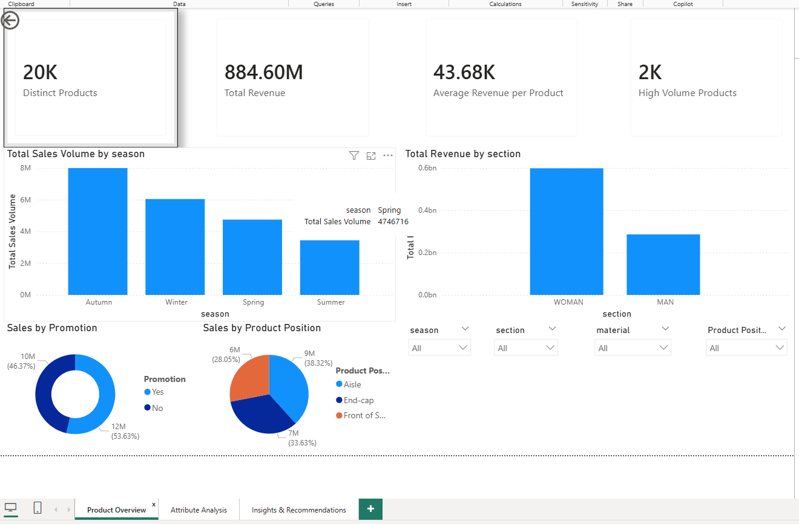

Custom BI Project – Retail Product Attribute Analysis

Author: Derek Wilkerson
Course: CSIS 44632 – Business Intelligence & Analytics (NWMSU)
Instructor: Dr. Denise Case

This repository contains a P7 Custom BI Project that delivers an end-to-end Business Intelligence solution using a retail product dataset.
The goal is to model product-level attributes in Power BI and build dashboards that support real merchandising and pricing decisions.

🧠 What This Project Does

This custom BI project analyzes a retail product dataset to understand which product attributes influence sales performance.
The project focuses on:

Product material (e.g., Cotton, Wool, Linen)

Product type (e.g., Jackets, T-shirts, Shoes)

Placement and visibility (Aisle, End-cap, Front of Store)

Section (Men/Women)

Season and seasonal trends

Brand and promotional effects

Using Power Query and DAX inside Power BI, the project:

Cleans and models the dataset

Creates calculated columns and measures

Builds interactive dashboards to surface trends

Produces insights to guide merchandising and pricing decisions

💼 Tech Stack

This project uses a modern BI and analytics toolset designed for rapid data transformation, modeling, and dashboard creation:

Power BI Desktop
Used to build the data model, relationships, visuals, and interactive dashboards.

Power Query (M Language)
Performs data cleaning, shaping, and transformation before loading into the model.

DAX (Data Analysis Expressions)
Creates calculated columns, KPIs, time intelligence, and performance metrics.

CSV / Flat Files
The dataset is sourced from a CSV representing a retail product catalog.

Git & GitHub
Provides version control, collaboration, and publicly accessible project documentation.

📁 Repository Structure

The repository is organized into clear folders to support data, documentation, images, and the final Power BI report:

custom-bi-project-wilkersonderek/
│
├─ data/
│ ├─ raw/
│ │ └─ Business_sales_EDA.csv
│ └─ prepared/
│
├─ docs/
│
├─ images/
│ ├─ page1.png
│ ├─ page2.png
│ └─ page3.png
│
├─ powerbi/
│
├─ reports/
│
├─ custom-bi-project-wilkersonderek.pbix
├─ LICENSE
└─ README.md

🧭 How to Open & Explore the Report

Follow these steps to view and interact with the dashboards:

Make sure you have Power BI Desktop installed.

Clone or download this repository to your local machine.

Open the file:
custom-bi-project-wilkersonderek.pbix

When the report opens in Power BI Desktop, use the page tabs at the bottom to switch between:

Overview

Product Attribute Analysis

Insights & Recommendations

Use slicers (filters) on the pages to explore performance by:

Product type

Material

Placement (Aisle, End-cap, Front of Store)

Season

Section (Men/Women)

Brand

📊 Dashboard Pages

The report contains three main pages, each focused on a different layer of insight.

🔹 Page 1 – Overview Dashboard

This page provides a high-level summary of overall performance so a manager can quickly see how the business is doing.

Key elements include:

Total revenue

Total units sold

Number of distinct products

Average revenue per product

Revenue and units sold by product type

Screenshot: 

🔹 Page 2 – Product Attribute Analysis

This page digs deeper into how key product attributes influence performance.

You can analyze results by:

Material (for example Cotton, Wool, Linen, Polyester)

Product type (Jackets, Shoes, T-shirts, Jeans, etc.)

Product position (Aisle, End-cap, Front of Store)

Section (Men vs Women)

Season

Brand

Screenshot:C:\Repos\custom-bi-project-wilkersonderek\images\page2.png

🔹 Page 3 – Insights & Recommendations

This page summarizes the most important findings and highlights where the retailer should focus attention.

It brings together:

Top performing product types and materials

Placement strategies that generate the most revenue

Promotion effectiveness

Opportunities to shift assortment, pricing, or layout

Screenshot: C:\Repos\custom-bi-project-wilkersonderek\images\page3.png
